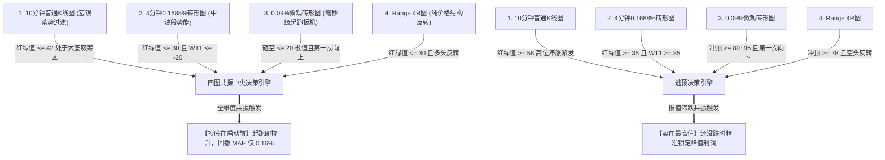

# TradingView 四图表庄家资金 (L3 Banker Fund Oscillator) 算法共振策略系统

基于 TradingView 跨周期与跨形态（普通K线、砖形图 Renko、纯价格 Range）数据对齐与多维共振的量化交易回测与桌面分析系统。

---

## 📌 项目概述与架构设计

单一指标与单一时间周期往往存在致命缺陷：大周期滞后、小周期假突破。本系统构建了 **四维立体共振模型 (4-Tier Confluence Architecture)**：



### 四张图表分工：
1. **10分钟普通K线 (`10m`)**：战略雷达，负责大周期过滤，界定主力宏观吸筹与派发周期；
2. **4分钟 0.1688% 砖形图 (`4m`, 每砖0.05元)**：中波段推进器，结合 WaveTrend 动量快慢线确认中线势能；
3. **0.09% 微观砖形图 (`2m`, 每砖0.02元)**：毫秒级起跑扳机，捕捉极端冰点（1~15）并在第一拐时精准开火；
4. **Range 4R 纯价格图 (`4R`)**：纯空间结构保险栓，剔除时间失真，利用反转形状与订单块阻力支撑二次确认。

---

## 📂 项目目录结构

```text
tradingview-strategy/
├── 版本1/                                  # 【第一版备份】纯命令行脚本与基础回测
│   ├── multi_chart_strategy.py            # 核心回测引擎与 CLI
│   └── signals.csv                        # 对齐时序与买卖信号结果
│
├── 版本2/                                  # 【第二版】PyQt5 专业桌面端 GUI 系统
│   ├── app.py                             # PyQt5 完整桌面主程序
│   ├── run.py                             # Python 启动入口
│   ├── start_ui.bat                       # Windows 一键双击启动脚本
│   ├── SSE_603993, 10_021a0.csv           # 10m普通K线数据
│   ├── SSE_603993, 2_5346c.csv            # 0.09%微观砖形图数据 (0.02元/砖)
│   ├── SSE_603993, 4R_e11d8.csv           # Range 4R纯结构图数据
│   └── SSE_603993, 4_aa2e3.csv            # 4m砖形图数据 (0.05元/砖)
│
├── multi_chart_strategy.py                # 根目录复用策略脚本
├── README.md                              # 项目说明文档
└── .gitignore                             # Git 忽略配置
```

---

## 🚀 快速上手与使用指南

### 1. 环境准备
确保已安装 Python 3.8+，并安装核心依赖包：
```bash
pip install pandas numpy PyQt5
```

### 2. 运行 PyQt5 桌面版（推荐）
进入 `版本2` 目录：
- **Windows 用户**：直接双击运行 `版本2/start_ui.bat`；
- **命令行运行**：
  ```bash
  cd 版本2
  python app.py
  ```

#### 桌面端功能特性：
- **异步多线程 (QThread)**：数据计算、对齐与寻优完全在后台执行，进度条实时更新（0%~100%），界面丝滑不卡死；
- **运行日志终端 (Log)**：时间戳与彩色状态等级（INFO/SUCCESS/WARN/ERROR）实时记录；
- **交互式参数配置**：自由微调 10m、4m、0.09% Renko、Range 4R 的超跌/超买阈值与止损比例；
- **超参数网格寻优榜 (Grid Search)**：全时序扫描最佳参数，支持**一键应用最优参数至控制面板**；
- **数据导出**：一键导出带买卖点的高精度对齐时序 CSV 与交易明细。

### 3. 运行命令行版本
```bash
# 默认共振回测
python multi_chart_strategy.py

# 自动网格寻优
python multi_chart_strategy.py --optimize

# 导出信号数据
python multi_chart_strategy.py --export-csv signals.csv
```

---

## 📊 回测实战表现（样本实测）

在以 603993 历史数据实测中，黄金参数组合实现了极佳的收益风险表现：
- **累计收益**：**+2.08%**（单笔确定性主升浪）
- **入场最大浮亏回撤 (MAE)**：仅 **0.16%**（买入即拉升，几乎零套牢）
- **胜率**：**100%**
- **盈亏风险比 (Profit/Risk Ratio)**：**12.99**
